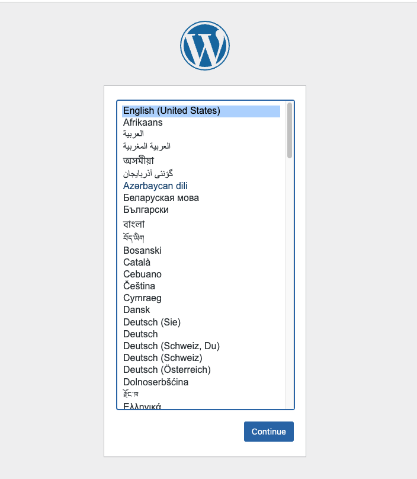

# Deploy Wordpress application into Kubernetes

1; Create secret

```
mkdir myblog-wp && cd myblog-wp
 # base 64 encrypted format for MYSQL_ROOT_PASSWORD
echo -n 'nazgul' | base64
bmF6Z3Vs
# secret.yaml
apiVersion: v1
kind: Secret
metadata:
  name: mysecret
type: Opaque
data:
  # base64 encrypted format
  MYSQL_ROOT_PASSWORD: a2FpemVu
  db_password: a2FpemVu
```

2; Create mysql.yaml

```
apiVersion: v1
kind: Service
metadata:
  name: mysql
  labels:
    app: mysql
spec:
  ports:
    - port: 3306
  selector:
    app: mysql
  clusterIP: None

---
apiVersion: apps/v1
kind: StatefulSet
metadata:
  name: mysql-container
spec:
  serviceName: mysql
  replicas: 1
  selector:
    matchLabels:
      app: mysql
  template:
    metadata:
      labels:
        app: mysql
    spec:
      containers:
      - name: mysql
        image: mysql:5.6
        env:
          - name: MYSQL_ROOT_PASSWORD
            valueFrom:
              secretKeyRef:
                name: mysecret
                key: MYSQL_ROOT_PASSWORD
          - name: MYSQL_DATABASE
            value: wordpress
          - name: MYSQL_USER
            value: wordpress
          - name: MYSQL_PASSWORD
            valueFrom:
              secretKeyRef:
                name: mysecret
                key: db_password
        ports:
        - containerPort: 3306
        volumeMounts:
          - name: mysql-persistent-storage
            mountPath: /var/lib/mysql
  volumeClaimTemplates:
    - metadata:
        name: mysql-persistent-storage
      spec:
        storageClassName: "standard"
        accessModes: ["ReadWriteOnce"]
        resources:
         requests:
          storage: 5Gi
```

3; Create wordpress.yaml

```
apiVersion: v1
kind: PersistentVolumeClaim
metadata:
  name: wordpress-volume
  labels:
    app: wordpress
spec:
  accessModes:
    - ReadWriteOnce
  resources:
    requests:
      storage: 20Gi
---
apiVersion: apps/v1
kind: Deployment
metadata:
  name: wordpress
spec:
  replicas: 1
  selector:
    matchLabels:
      app: wordpress
  template:
    metadata:
      labels:
        app: wordpress
    spec:
      containers:
        - name: wordpress
          image: wordpress:5.8.3-php7.4-apache
          ports:
          - containerPort: 80
            name: wordpress
          volumeMounts:
            - name: wordpress-data
              mountPath: /var/www
          env:
            - name: WORDPRESS_DB_HOST
              value: mysql.default.svc.cluster.local
            - name: WORDPRESS_DB_PASSWORD
              valueFrom:
                secretKeyRef:
                  name: mysecret
                  key: MYSQL_ROOT_PASSWORD
            - name: WORDPRESS_DB_USER
              value: wordpress
            - name: WORDPRESS_DB_NAME
              value: wordpress
      volumes:
        - name: wordpress-data
          persistentVolumeClaim:
            claimName: wordpress-volume
```

```
kubectl expose deployment/wordpress --type=LoadBalancer
kubectl get all
NAME                             READY   STATUS    RESTARTS   AGE
pod/mysql-container-0            1/1     Running   0          8m47s
pod/wordpress-586558c489-srkwl   1/1     Running   0          7m54s

NAME                 TYPE           CLUSTER-IP   EXTERNAL-IP      PORT(S)        AGE
service/kubernetes   ClusterIP      10.8.0.1     <none>           443/TCP        139m
service/mysql        ClusterIP      None         <none>           3306/TCP       8m48s
service/wordpress    LoadBalancer   10.8.7.28    34.136.239.199   80:32331/TCP   4m56s

NAME                        READY   UP-TO-DATE   AVAILABLE   AGE
deployment.apps/wordpress   1/1     1            1           7m54s

NAME                                   DESIRED   CURRENT   READY   AGE
replicaset.apps/wordpress-586558c489   1         1         1       7m54s

NAME                               READY   AGE
statefulset.apps/mysql-container   1/1     8m48s
```

